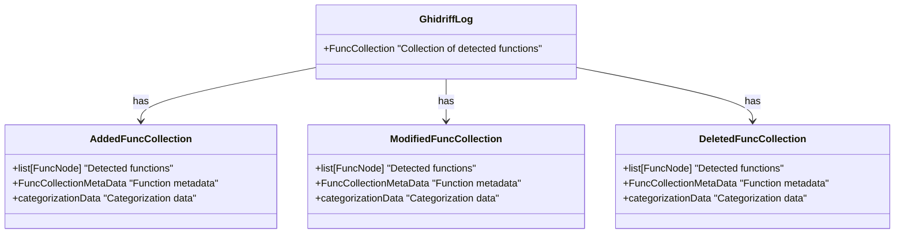
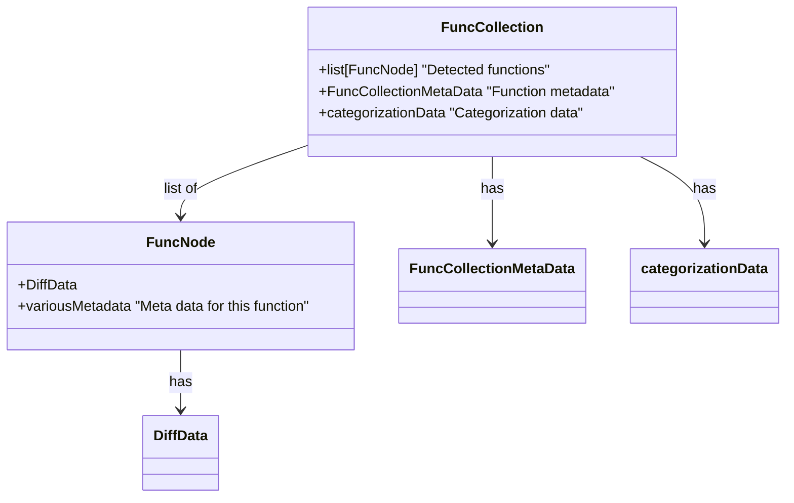

# Version comparison classification

>[!note]
> Developed by Max Wilén & Jacob Ringfjord, as part of our CS Master thesis. Also see thesis repo [here](https://github.com/mxwilen/master-thesis/tree/main).

A pipeline for classification of Ghidriff output data. Uses syntax matching against functions and their parents/neighbors to categorize changes.

## Prerequisite
Ghidra requires JDK to run, so make sure Java Development Kit (JDK) 17 or higher is available.
```bash
pip install -r requirements.txt
```

### Install Ghidra
>[!NOTE] Ghidra
> Ghidra is a software reverse engineering (SRE) framework developed by the National Security Agency (NSA). It helps analyze compiled code on various platforms including Windows, macOS, and Linux.

#### Using homebrew
```bash
brew install --cask ghidra
```

#### Using Chocolatey
```bash
choco install ghidra
```

Then verify setup by running `ghidraRun`.

### Setup Ghidriff
>[!NOTE] Ghidriff
> `ghidriff` provides a command-line binary diffing capability with a fresh take on diffing workflow and results. This project, developed over the course of a year, leverages the power of Ghidra's ProgramAPI and FlatProgramAPI to find the _added_, _deleted_, and _modified_ functions of two arbitrary binaries. It is written in Python3 using pyhidra to orchestrate Ghidra and `jpype` as the Python to Java interface to Ghidra. 
> For more info, see [Ghidriff repo](https://github.com/clearbluejar/ghidriff)

*Already installed through `requirements.txt` using pip.*

### Set paths in `.env`
Change this path in the environment file.

```bash
GHIDRA_INSTALL_DIR=<path_to_here>/ghidra/XX.X-XXXXXXXX/ghidra_XX.X_PUBLIC/
```


## How to run

1. Put the two apks to analyse inside the folder `signal-binaries`
2. Change the `.env` vars pointing to these binaries
```sh
APK_LOC_V1=signal-binaries/Signal_Android_7.30.2.apk
APK_LOC_V2=signal-binaries/Signal_Android_7.31.0.apk
```
3. Execute start scripts
   
   Windows:
   ```bash
    ./run.bat
    ```

    Linux / Mac:
    ```bash
    sh run.sh
    ```


## Structure of parsing and categorization data






